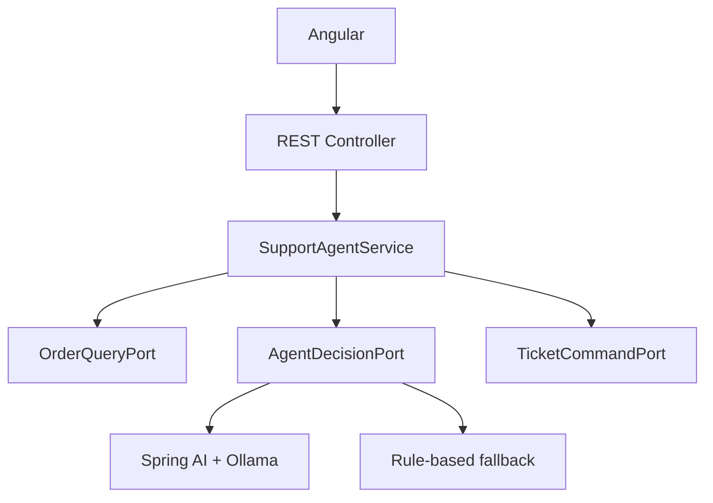

# Enterprise AI Support Platform

Plataforma Full Stack de suporte corporativo que combina Java, Angular e IA generativa para analisar pedidos e decidir quando um chamado deve ser aberto.

O projeto foi construído como um workflow agêntico híbrido: o modelo participa da tomada de decisão, enquanto a aplicação Java mantém o controle das regras, validações e ações de negócio.

## Funcionalidades atuais

- Consulta de pedidos fictícios em memória.
- Identificação de pedidos atrasados por regra de domínio.
- Análise da solicitação do cliente por IA generativa.
- Retorno estruturado da decisão do modelo.
- Abertura de chamado quando necessária.
- Trilha das operações executadas durante o atendimento.
- Interface Angular responsiva para envio e visualização da solicitação.
- Alternância entre Ollama e decisão determinística por Spring Profiles.
- Validação das entradas e respostas HTTP no formato Problem Details.
- Health check, métricas e informações operacionais pelo Spring Boot Actuator.
- Testes unitários do domínio, caso de uso e frontend.

## Tecnologias

### Backend

- Java 21
- Spring Boot 4.1.1
- Spring AI 2.0.1
- Spring Web MVC
- Bean Validation
- Spring Boot Actuator
- Maven Wrapper
- JUnit

### Inteligência artificial

- Ollama
- Qwen3 4B Instruct
- Spring AI `ChatClient`
- Structured Output para conversão da resposta do LLM em record Java

### Frontend

- Angular 22.1
- TypeScript
- Standalone Components
- Signals
- Reactive Forms
- RxJS
- SCSS
- Vitest

## Arquitetura

O backend utiliza arquitetura hexagonal. O caso de uso depende de portas, não de detalhes como HTTP, persistência ou provedor de IA.



### Fluxo de atendimento

1. O frontend envia a identificação do cliente, o pedido e a mensagem.
2. O backend localiza o pedido por meio de `OrderQueryPort`.
3. `AgentDecisionPort` avalia os dados do pedido e a mensagem.
4. A resposta é convertida em um `AgentDecision` estruturado.
5. `SupportAgentService` decide se deve executar `TicketCommandPort`.
6. A API devolve a resposta, o status do pedido, o chamado e a trilha de execução.

> Atualmente, `getOrder`, `evaluateSupportPolicy` e `createTicket` representam a trilha auditável do workflow. Eles ainda não são tools chamadas diretamente pelo LLM. Tool calling nativo está planejado para uma próxima evolução.

## Estrutura do monorepo

```text
enterprise-ai-support/
├── backend/
│   ├── .mvn/
│   ├── src/
│   │   ├── main/
│   │   │   ├── java/com/joaodev/aisupport/
│   │   │   └── resources/application.yaml
│   │   └── test/
│   ├── mvnw
│   └── pom.xml
└── frontend/
    ├── src/
    │   └── app/
    │       ├── models/
    │       ├── services/
    │       ├── app.ts
    │       ├── app.html
    │       └── app.scss
    ├── package.json
    └── angular.json
```

## Profiles de decisão

### Profile padrão

Utiliza `RuleBasedAgentDecisionAdapter`. Não depende do Ollama e permite executar a aplicação de forma determinística:

```bash
cd backend
./mvnw spring-boot:run
```

### Profile Ollama

Utiliza `OllamaAgentDecisionAdapter`, Spring AI e um modelo local:

```bash
cd backend
./mvnw spring-boot:run \
  -Dspring-boot.run.profiles=ollama
```

Os adaptadores implementam a mesma `AgentDecisionPort`, portanto o caso de uso não conhece o mecanismo responsável pela decisão.

## Pré-requisitos

- Java 21
- Node.js compatível com Angular 22
- npm
- Ollama, para executar o profile `ollama`

Confirme as instalações:

```bash
java -version
node --version
npm --version
ollama --version
```

## Preparando o Ollama

Baixe o modelo utilizado pelo projeto:

```bash
ollama pull qwen3:4b-instruct
```

Confira se o serviço está disponível:

```bash
curl http://localhost:11434/api/tags
```

As configurações podem ser substituídas por variáveis de ambiente:

```bash
export OLLAMA_BASE_URL=http://localhost:11434
export OLLAMA_MODEL=qwen3:4b-instruct
```

## Executando o projeto

### 1. Backend com Ollama

```bash
cd backend
./mvnw spring-boot:run \
  -Dspring-boot.run.profiles=ollama
```

A API estará disponível em `http://localhost:8080`.

### 2. Frontend

Em outro terminal:

```bash
cd frontend
npm install
npm start
```

A interface estará disponível em `http://localhost:4200`.

## Endpoint

### Solicitar assistência

```http
POST /api/v1/support/assist
Content-Type: application/json
```

Exemplo para um pedido atrasado:

```bash
curl -X POST http://localhost:8080/api/v1/support/assist \
  -H "Content-Type: application/json" \
  -d '{
    "customerId": "customer-1",
    "orderId": "order-18273",
    "message": "My order is delayed. Investigate it and open a ticket if necessary."
  }'
```

Resposta de exemplo:

```json
{
  "answer": "My order is delayed. Ticket ticket-e953bdfe opened successfully",
  "orderId": "order-18273",
  "orderStatus": "SHIPPED",
  "ticketId": "ticket-e953bdfe",
  "executedTools": [
    "getOrder",
    "evaluateSupportPolicy",
    "createTicket"
  ]
}
```

Pedidos disponíveis para demonstração:

| Pedido | Situação | Resultado esperado |
| --- | --- | --- |
| `order-18273` | Enviado e atrasado | Abre um chamado |
| `order-10001` | Entregue | Não abre chamado |

## Testes

### Backend

```bash
cd backend
./mvnw clean test
```

Os testes unitários utilizam implementações simples das portas e não precisam inicializar o Ollama.

### Frontend

```bash
cd frontend
npm test -- --watch=false
npm run build
```

## Observabilidade

Com o backend em execução, o Actuator disponibiliza:

```text
GET http://localhost:8080/actuator/health
GET http://localhost:8080/actuator/info
GET http://localhost:8080/actuator/metrics
```

## Limitações atuais

- Pedidos e chamados são mantidos apenas em memória.
- O modelo participa da decisão, mas ainda não seleciona e chama tools diretamente.
- Não há autenticação ou autorização.
- Não há memória conversacional ou RAG.
- A solução ainda não está conteinerizada.

## Roadmap

- [ ] Tool calling nativo com Spring AI.
- [ ] Persistência com PostgreSQL e Flyway.
- [ ] RAG com PostgreSQL e pgvector.
- [ ] Publicação de eventos com Kafka e Outbox Pattern.
- [ ] Cache com Redis.
- [ ] Autenticação OAuth2/OIDC com Keycloak.
- [ ] Observabilidade com OpenTelemetry, Prometheus e Grafana.
- [ ] Docker Compose.
- [ ] Deploy em Kubernetes.
- [ ] Pipeline de CI/CD.

## Objetivo técnico

O projeto busca demonstrar que integrar IA a uma aplicação corporativa vai além de enviar prompts para um modelo. A solução separa a decisão probabilística das ações determinísticas, preservando testabilidade, segurança, portabilidade e auditabilidade.
